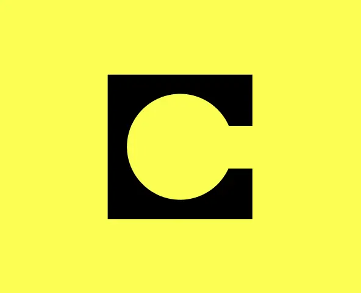

# 🎮 Quizelo - AI-Powered Celo Quiz Platform

**Learn Celo, Earn CELO!** An interactive quiz platform built on Celo blockchain with AI-generated questions and real rewards.



## 🌟 Features

- **🤖 AI-Generated Questions**: Unique, personalized quizzes for each player
- **💰 Real CELO Rewards**: Earn actual CELO tokens for scoring 60% or higher
- **🎯 Daily Challenges**: 3 quizzes per day with 20-minute cooldowns
- **🏆 Leaderboards**: Compete with other players globally
- **📱 Mobile-First**: Optimized for mobile and Farcaster Mini Apps
- **🔗 Farcaster Integration**: Native Farcaster Frame support
- **⚡ Instant Rewards**: Immediate payout upon successful completion

## 🚀 Live Demo

- **Main App**: [https://quizelo.vercel.app](https://quizelo.vercel.app)
- **Farcaster Frame**: Share and play directly in Farcaster

## 📋 Smart Contract Details

### Contract Addresses

**Mainnet (Celo)**
- Contract: `0x1234567890123456789012345678901234567890`
- Network: Celo Mainnet (Chain ID: 42220)
- Explorer: [CeloScan](https://celoscan.io/address/0x1234567890123456789012345678901234567890)

**Testnet (Alfajores)**
- Contract: `0x0987654321098765432109876543210987654321`
- Network: Celo Alfajores (Chain ID: 44787)
- Explorer: [Alfajores CeloScan](https://alfajores.celoscan.io/address/0x0987654321098765432109876543210987654321)

### Contract Constants

```solidity
QUIZ_FEE = 0.1 CELO
QUIZ_DURATION = 10 minutes
COOLDOWN_PERIOD = 20 minutes
MAX_DAILY_QUIZZES = 3
MIN_CONTRACT_BALANCE = 1 CELO
```

### Reward Structure

**First Win of the Day:**
- 40% chance: 0.1 CELO
- 25% chance: 0.15 CELO
- 15% chance: 0.2 CELO
- 10% chance: 0.25 CELO
- 5% chance: 0.3 CELO
- 3% chance: 0.35 CELO
- 2% chance: 0.4 CELO

**Score Bonuses:**
- 90%+: +0.02 CELO bonus
- 80%+: +0.01 CELO bonus

**Subsequent Wins:**
- 70% chance: 0.1 CELO
- 20% chance: 0.15 CELO
- 10% chance: 0.2 CELO

## 🛠️ Tech Stack

- **Frontend**: Next.js 15, React 18, TypeScript
- **Styling**: Tailwind CSS, Framer Motion
- **Blockchain**: Viem, Wagmi, Celo
- **AI**: OpenAI GPT-4 for question generation
- **Authentication**: Farcaster Auth Kit
- **Deployment**: Vercel

## 📦 Installation

1. **Clone the repository**
```bash
git clone https://github.com/yourusername/quizelo.git
cd quizelo
```

2. **Install dependencies**
```bash
yarn install
```

3. **Set up environment variables**
```bash
cp .env.example .env.local
```

4. **Configure environment variables**
```env
# App Configuration
NEXT_PUBLIC_URL=https://your-domain.vercel.app
NEXT_PUBLIC_ENV=production

# Smart Contract
NEXT_PUBLIC_QUIZELO_CONTRACT_ADDRESS=0x1234567890123456789012345678901234567890

# Divvi Referral Tracking
NEXT_PUBLIC_DIVVI_CONSUMER_ADDRESS=0x53eaF4CD171842d8144e45211308e5D90B4b0088

# AI Configuration
NEXT_PUBLIC_OPENAI_API_KEY=your-openai-api-key

# Farcaster Configuration
NEXT_PUBLIC_NEYNAR_API_KEY=your-neynar-api-key
FARCASTER_DEVELOPER_MNEMONIC=your-farcaster-mnemonic

# Database (Optional)
UPSTASH_REDIS_REST_URL=your-redis-url
UPSTASH_REDIS_REST_TOKEN=your-redis-token
```

5. **Run the development server**
```bash
yarn dev
```

6. **Build for production**
```bash
yarn build
yarn start
```

## 🎯 How to Play

1. **Connect Wallet**: Connect your Celo wallet (MetaMask, Coinbase Wallet, etc.)
2. **Select Topic**: Choose from various Celo-related topics
3. **Pay Entry Fee**: Pay 0.1 CELO to start the quiz
4. **Answer Questions**: Complete 5 AI-generated questions within 10 minutes
5. **Claim Rewards**: Score 60% or higher to earn CELO rewards
6. **Track Progress**: View your stats and leaderboard position

## 🔧 Smart Contract Functions

### User Functions
- `startQuiz()` - Start a new quiz (payable with 0.1 CELO)
- `claimReward(bytes32 sessionId, uint256 score)` - Claim rewards after completion
- `cleanupExpiredQuiz(bytes32 sessionId)` - Clean up expired quiz sessions

### View Functions
- `getUserInfo(address user)` - Get user's quiz statistics
- `getContractStats()` - Get contract balance and operational status
- `getCurrentQuizTakers()` - Get list of active quiz takers
- `calculatePotentialReward(address user, uint256 score)` - Calculate potential reward

### Admin Functions
- `topUpContract()` - Add funds to contract (owner only)
- `adminEmergencyDrain()` - Emergency fund withdrawal (owner only)
- `adminCleanupExpired()` - Clean up all expired quizzes (owner only)

## 🎨 UI Components

The app features a modern, mobile-first design with:

- **Animated Cards**: Smooth transitions and hover effects
- **Progress Indicators**: Real-time quiz progress and timers
- **Leaderboards**: Global and personal statistics
- **Responsive Design**: Optimized for all screen sizes
- **Dark/Light Themes**: Automatic theme detection

## 🌐 Farcaster Integration

Quizelo is fully integrated with Farcaster:

- **Frame Support**: Play directly in Farcaster feeds
- **Mini App**: Native mobile experience in Farcaster app
- **Social Features**: Share scores and achievements
- **Wallet Integration**: Seamless wallet connection

## 📊 Analytics & Leaderboards

- **Global Stats**: Total players, quizzes, and rewards distributed
- **Personal Stats**: Individual performance tracking
- **Top Earners**: Leaderboard of highest earners
- **Win Rates**: Success rate statistics

## 🔒 Security Features

- **Reentrancy Protection**: Secure against reentrancy attacks
- **Ownable Contract**: Admin functions protected
- **Balance Checks**: Ensures sufficient funds for rewards
- **Time Validation**: Prevents expired quiz claims
- **Score Validation**: Ensures valid score submissions

## 🚀 Deployment

### Vercel Deployment

1. **Connect Repository**: Link your GitHub repository to Vercel
2. **Set Environment Variables**: Configure all required environment variables
3. **Deploy**: Vercel will automatically build and deploy your app

### Contract Deployment

The smart contract is deployed using Atlas IDE:

1. **Compile Contract**: Use Remix or Hardhat to compile
2. **Deploy to Celo**: Use Atlas IDE or Remix for deployment
3. **Verify Contract**: Verify on CeloScan for transparency
4. **Fund Contract**: Add initial funds for rewards

## 🤝 Contributing

1. Fork the repository
2. Create a feature branch (`git checkout -b feature/amazing-feature`)
3. Commit your changes (`git commit -m 'Add amazing feature'`)
4. Push to the branch (`git push origin feature/amazing-feature`)
5. Open a Pull Request

## 📄 License

This project is licensed under the MIT License - see the [LICENSE](LICENSE) file for details.

## 🙏 Acknowledgments

- **Celo Foundation** for the amazing blockchain platform
- **Farcaster** for social integration
- **OpenAI** for AI question generation
- **Vercel** for hosting and deployment
- **Wagmi** for React hooks for Ethereum

## 📞 Support

- **Discord**: Join our community
- **Twitter**: [@QuizeloApp](https://twitter.com/QuizeloApp)
- **Email**: support@quizelo.app
- **GitHub Issues**: Report bugs and feature requests

---

**Built with ❤️ for the Celo community**


